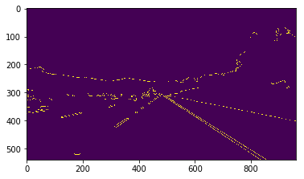

**Finding Lane Lines on the Road**
==================================

---

**Finding Lane Lines on the Road**

The goals / steps of this project are the following:
* Make a pipeline that finds lane lines on the road
* Reflect on your work in a written report

---

### Reflection

### 1. Describe your pipeline. As part of the description, explain how you modified the draw_lines() function.

My pipeline consisted of 6 steps:
  First, I converted the images to grayscale as this helps with Canny edge detection.

  Second, I applied Gaussian smoothing to reduce the noise in the image and thus help with Canny edge detection.

  Third, I applied Canny edge detection which identifies all edges in the image.

  Fourth, I applied region selection to only focus on the region of the image the lane lines are in.

  Fifth, I applied the Hough transform to identify the lines in the image. This took a bit of trial and error as the parameters have to be optimal in order for the lines in the draw_lines function to correctly be mapped to the actual lane lines.
  Sixth, I applied the draw_lines function to average and extrapolate the lines given by the Hough transform and uniformly extend them over the lane lines on the road.

In order to draw a single line on the left and right lanes, I modified the draw_lines() function by calculating the slope by taking the x1, x2, y1, and y2 values given by the Hough transform. Using this slope, I determined if each line corresponds to the left or right side of the lane by determining if the slope is positive or negative. Next, for each side of the lane, I averaged the x and y coordinates. Using the slope and intecept, I extrapolated the lines to the top and bottom of the region of selection (mentioned above in the fourth step). Then I overlaid the lines on the original image to show the identified lane lines.

### 2. Identify potential shortcomings with your current pipeline

My pipeline has a tendency for the drawn right lane to be off the actual lane by a large angle in the videos. The problem was a lot worse in development, but tuning the parameters of the cv2.HoughLinesP function improved performance significantly. This problem is much more apparent in the challenge video.

Another shortcoming is that the pipeline uses region selection to determine the lane lines. Traveling on terrain that isn't flat would invalidate this region selection and the lane lines would fail to be recognized.

The Canny edge detection relies on a large contrast in the image. If lane lines are faded or if lighting is poor such that this contrast isn't significant, Canny edge detection could fail to identify the lane lines.

### 3. Suggest possible improvements to your pipeline

A possible improvement would be to apply machine learning to the identification of the lane lines. Using this and a large dataset, the lane line detection could be adaptive to a large variety of conditions and terrains and be more fault tolerant.

My draw_lines function could be optimized as it isn't vectorized nor pythonic.
