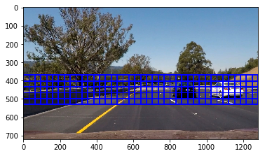

## Writeup Template
### You can use this file as a template for your writeup if you want to submit it as a markdown file, but feel free to use some other method and submit a pdf if you prefer.

---

**Vehicle Detection Project**

The goals / steps of this project are the following:

* Perform a Histogram of Oriented Gradients (HOG) feature extraction on a labeled training set of images and train a classifier Linear SVM classifier
* Optionally, you can also apply a color transform and append binned color features, as well as histograms of color, to your HOG feature vector.
* Note: for those first two steps don't forget to normalize your features and randomize a selection for training and testing.
* Implement a sliding-window technique and use your trained classifier to search for vehicles in images.
* Run your pipeline on a video stream (start with the test_video.mp4 and later implement on full project_video.mp4) and create a heat map of recurring detections frame by frame to reject outliers and follow detected vehicles.
* Estimate a bounding box for vehicles detected.

[//]: # (Image References)
[image1]: ./examples/car_not_car.png

## [Rubric](https://review.udacity.com/#!/rubrics/513/view) Points
### Here I will consider the rubric points individually and describe how I addressed each point in my implementation.  

---
### Writeup / README

#### 1. Provide a Writeup / README that includes all the rubric points and how you addressed each one.  You can submit your writeup as markdown or pdf.  [Here](https://github.com/udacity/CarND-Vehicle-Detection/blob/master/writeup_template.md) is a template writeup for this project you can use as a guide and a starting point.  

You're reading it!

### Histogram of Oriented Gradients (HOG)

#### 1. Explain how (and identify where in your code) you extracted HOG features from the training images.

The code for this step can be found in cells 7 through 13 of Vehicle-Detection.ipynb.  

I started by reading in all the `vehicle` and `non-vehicle` images.  Here is an example of one of each of the `vehicle` and `non-vehicle` classes:

![alt text][image1]

I then explored the RGB, HLS, LUV, HSV, YCrCb, and YUV color spaces with 3D plots to see if I could find any distinguishing information in them. The HLS color space seemed to have some distinguishing features.

Next, I spatially binned the colors to reduce the number of features being processed. This converts the color space of the image as desired, resizes the image to 32x32, and ravels the image from 2D to a 1D vector.

To generalize the colors for similar cars, I used a histogram for each channel of an image. I then created a Histogram of Oriented Gradients (HOG) to create a fingerprint of an area and check its similarity to a car.

#### 2. Explain how you settled on your final choice of HOG parameters.

I tried the HOG method with the RGB, HLS, LUV, YUV, and YCrCb color spaces as seen here (found in Vehicle-Detection.ipynb cell 8):

The results looked quite similar to each other, so I decided to stick with YCrCb because the Y channel corresponds to the light intensity while the Cr and Cb channels hold color information independent of brightness. This seems like it will be a good choice to minimize fluctuations in brightness.

I tested out the various color spaces with the HOG method to see how they would turn out (found in Vehicle-Detection.ipynb cell 12):

I then picked a several different settings for the HOG parameters, including orientations, pixels_per_cell, and cells_per_block, to see how well they worked. The results of this comparison can be seen here (found in Vehicle-Detection.ipynb cell 13):

Ultimately, it appears the settings with orientations = 11, pixels_per_cell = 10, and cells_per_block = 4 worked best.

#### 3. Describe how (and identify where in your code) you trained a classifier using your selected HOG features (and color features if you used them).

I applied some random image augmentations (noise, brightness, blur, mirror) and normalization to help generalize the dataset. I then tested the LinearSVC, SVC, and Decision Tree classifiers for time and accuracy to decide on which to use (found in Vehicle-Detection.ipynb cell 23).

Decision Tree training time: 133.41 seconds
 Decision Tree test accuracy: 0.9736
 Decision Tree prediction time: 0.04 seconds
 Linear SVC training time: 3.62 seconds
 Linear SVC test accuracy: 0.9932
 Linear SVC prediction time: 0.03 seconds
 SVC training time: 350.32 seconds
 SVC test accuracy: 0.9966
 SVC prediction time: 198.33 seconds

Of the three, the SVC was the most accurate, but it took by far the longest to train. The LinearSVC was much faster and only had slightly less accuracy than the SVC, so I chose to stick with it. The Decision Tree took longer to train than the LinearSVC and had a bit worse accuracy.

With the LinearSVC classifier, I checked out the confusion matrix to see if the false positives and false negatives were close to each other and ensure it wasn't biased to a particular class. It the false positives and negatives were similar to each other, so it looks like it is well balanced.

### Sliding Window Search

#### 1. Describe how (and identify where in your code) you implemented a sliding window search.  How did you decide what scales to search and how much to overlap windows?

I made a sliding windows function which takes in start and stop x and y values, the size of the grid squares, and the overlap and plots it on a test image to see how various values would look (found in Vehicle-Detection.ipynb cell 29).

#### 2. Show some examples of test images to demonstrate how your pipeline is working.  What did you do to optimize the performance of your classifier?

I tested the different sliding window sizes on some test images to see how they would perform. Unfortunately there were quite a few false positives.  Here are some example images (found in Vehicle-Detection.ipynb cell 33):

---

### Video Implementation

#### 1. Provide a link to your final video output.  Your pipeline should perform reasonably well on the entire project video (somewhat wobbly or unstable bounding boxes are ok as long as you are identifying the vehicles most of the time with minimal false positives.)
Here's a [link to my video result](./output_images/project_video.mp4)

#### 2. Describe how (and identify where in your code) you implemented some kind of filter for false positives and some method for combining overlapping bounding boxes.

I recorded the positions of positive detections in each frame of the video.  From the positive detections I created a heatmap and then thresholded that map to identify vehicle positions.  I then used `scipy.ndimage.measurements.label()` to identify individual blobs in the heatmap.  I then assumed each blob corresponded to a vehicle.  I constructed bounding boxes to cover the area of each blob detected.  

Here's an example result showing the heatmap from a series of frames of video, the result of `scipy.ndimage.measurements.label()` and the bounding boxes then overlaid on the last frame of video (found in Vehicle-Detection.ipynb cell 35):

In an effort to reduce the false positives, I implemented a memory to record car positions in previous frames.

---

### Discussion

#### 1. Briefly discuss any problems / issues you faced in your implementation of this project.  Where will your pipeline likely fail?  What could you do to make it more robust?

As can be seen in the heatmap images above and in the video [no-memory project video](./output_images/project_video_no_memory.mp4), I have consistently had problems with false positives. Even in images with no cars, I had consistent false detections, so much so they even gave strong detections in the heatmaps. To overcome these false detections, I implemented a form of memory to remember the car positions from the previous frames. This caused a trade-off in the robustness of the vehicle detection in the video. As can be seen in the video, the bounding boxes consistently lag the cars and are slow to detect them. By dialing back the memory, the false positives increase.

To make this system more robust, I would like to implement an end-to-end deep learning object detection system and compare its performance to the approach taken in this project.
